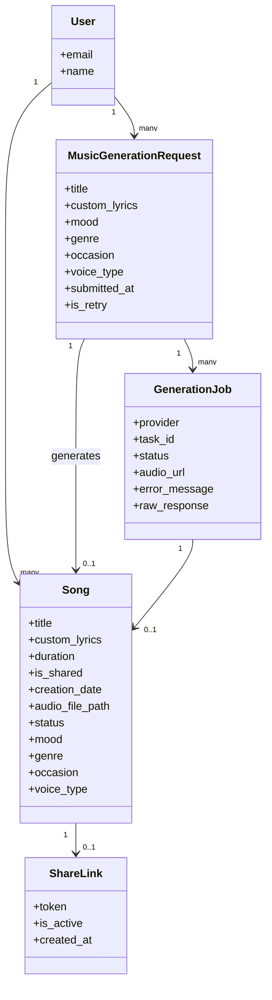
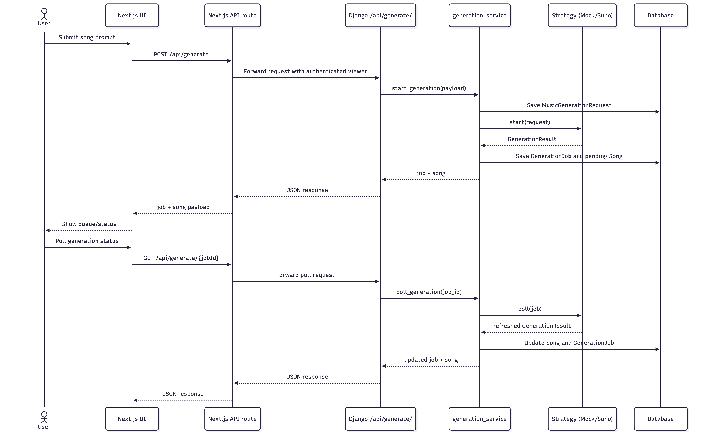
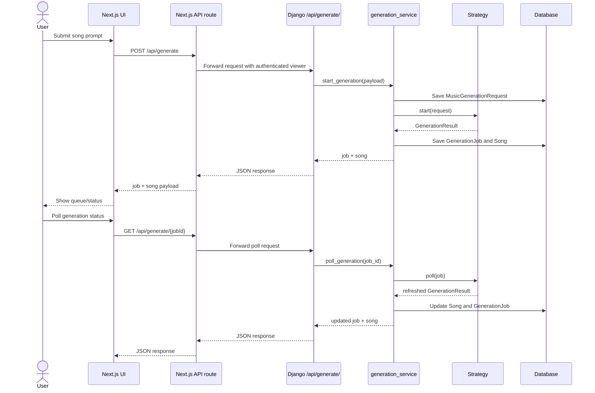

# Cithai

Cithai is an AI Music Generation Platform that gives users an intuitive interface to create custom songs from structured prompts (title, occasion, genre, voice type, mood, optional lyrics). Inputs are processed to generate unique compositions, and users manage their catalog via a personal library. 

Key benefits:
- Enable users to create personalized music without musical expertise.
- Provide instant music generation for various occasions and moods.
- Offer a simple, accessible interface for creative expression.
- Maintain user privacy with private-by-default song libraries.
- Support content moderation to prevent offensive content generation.
- Handle high traffic volumes (target: 1000+ requests per minute).

## Table of Contents
- [Project Info](#project-info)
- [Prerequisites](#prerequisites)
- [Quick Start (Docker — recommended)](#quick-start-docker--recommended)
- [Manual Local Setup](#manual-local-setup)
- [Testing](#testing)
- [Environment Variables](#environment-variables)
- [API Reference (JSON, minimal)](#api-reference-json-minimal)
- [Academic Context & Assignment Deliverables](#academic-context--assignment-deliverables)
- [License](#license)

## Project Info
- **Repo:** https://github.com/NapatKulnarong/cithai.git
- **Django:** 5.2.8

## Prerequisites
Before running the project locally, ensure you have the following installed:
- **Python:** 3.10+ (for Django backend)
- **Node.js:** v18+ (for Next.js frontend)
- **Docker & Docker Compose:** (Optional, but recommended for easiest setup)

## Quick Start (Docker — recommended)
The fastest way to get the entire stack (backend, frontend, database) running is via Docker Compose.

1. **Set up environment variables:**
   ```bash
   cp .env.example .env
   cp frontend/.env.example frontend/.env
   ```
   *(Note: For offline development, ensure `GENERATOR_STRATEGY=mock` in your root `.env`.)*

2. **Build and start the stack:**
   ```bash
   docker compose up --build
   ```

3. **Create a superuser (for backend admin access):**
   ```bash
   docker compose exec web python manage.py createsuperuser
   ```

- **Frontend:** http://localhost:3000
- **Backend Admin:** http://localhost:8000/admin

### Useful Docker Commands
- Start: `docker compose up -d` (detached mode)
- Stop: `docker compose down`
- Reset volumes: `docker compose down -v && docker compose up --build`
- Logs: `docker compose logs -f web`
- Shell: `docker compose exec web sh`
- Django Migrations: `docker compose exec web python manage.py migrate`

## Manual Local Setup
If you prefer not to use Docker, you can run the backend and frontend separately.

### 1. Backend Setup (Django)
```bash
# 1. Prepare environment variables
cp .env.example .env

# 2. Setup virtual environment
python -m venv venv
source venv/bin/activate

# 3. Install dependencies and migrate database
pip install -r requirements.txt
python manage.py migrate

# 4. Create admin user and run server
python manage.py createsuperuser
python manage.py runserver
```
The Django backend will be available at `http://localhost:8000`.

### 2. Frontend Setup (Next.js)
Open a **second terminal** and navigate to the frontend directory:
```bash
cd frontend

# 1. Prepare environment variables
cp .env.example .env

# 2. Install dependencies
npm install

# 3. Run development server
npm run dev
```
The Next.js frontend will be available at `http://localhost:3000` and will proxy requests to the Django API.

### Required Secrets & Third-Party Services
For full functionality (Google Login and real Suno generation), you need to configure external services:
- **Google OAuth Login (`frontend/.env`):**
  - Set `AUTH_SECRET` to a random secure string.
  - Set `AUTH_GOOGLE_ID` and `AUTH_GOOGLE_SECRET` by creating a Google Cloud OAuth application. Add `http://localhost:3000/api/auth/callback/google` as an authorized redirect URI.
- **Suno API (`.env` root):**
  - Set `SUNO_API_TOKEN` from your Suno API provider dashboard.
  - Set `GENERATOR_STRATEGY=suno`. *(Keep `mock` for local development without an API key).*

## Testing
To run the backend Django test suite (`songs/tests.py`):
```bash
# Using Docker
docker compose exec web python manage.py test

# Using Local Environment
python manage.py test
```

## Environment Variables

### Backend `.env`
| Variable | Default | Purpose |
|----------|---------|---------|
| `DJANGO_SECRET_KEY` | dev-secret-key-change-in-production | Django secret |
| `DEBUG` | True | Debug mode |
| `APP_BASE_URL` | `http://127.0.0.1:8000` | Base URL used for callbacks and backend links |
| `GENERATOR_STRATEGY` | `mock` | Active song-generation strategy: `mock` or `suno` |
| `SUNO_API_TOKEN` | empty | Suno bearer token. Keep this out of source control. |
| `SUNO_API_BASE` | `https://api.sunoapi.org` | Suno API base URL |
| `SUNO_MODEL` | `V3_5` | Model name sent to the generate endpoint |
| `SUNO_CALLBACK_URL` | empty | Optional callback URL. Polling works without it. |

### Frontend `.env`
| Variable | Default | Purpose |
|----------|---------|---------|
| `DJANGO_API_BASE` | `http://127.0.0.1:8000` | Django base URL for proxying requests |
| `AUTH_URL` | `http://localhost:3000` | Public frontend URL |
| `AUTH_SECRET` | empty | Auth.js session secret |
| `AUTH_GOOGLE_ID` | empty | Google OAuth client ID |
| `AUTH_GOOGLE_SECRET` | empty | Google OAuth client secret |

## API Reference (JSON, minimal)
Below are CRUD examples representing typical JSON endpoints (replace IDs with your own).

**Users**
- **Create:** `POST /api/users/`  (`{"name":"Demo User","email":"demo@example.com"}`)
- **Read:** `GET /api/users/` 
- **Update:** `PATCH /api/users/1/` (`{"name":"Demo User Updated"}`)
- **Delete:** `DELETE /api/users/1/`

**Songs**
- **Create:** `POST /api/songs/` (`{"title":"Demo","mood":"HAPPY","genre":"POP", ... "user_id":1}`)
- **Read:** `GET /api/songs/`
- **Update:** `PATCH /api/songs/1/` (`{"status":"COMPLETE","is_shared":true}`)
- **Delete:** `DELETE /api/songs/1/`

---

## Academic Context & Assignment Deliverables
*This section contains grading evidence and domain mapping for university coursework (Exercises 2, 3, and 4).*

### Domain Model Mapping (to Exercise 2)
- `User`: end user of the platform (email, name).
- `MusicGenerationRequest`: structured request input; links to `User`; stores mood/genre/occasion/voice_type, lyrics, retry flag.
- `Song`: core artifact; owned by `User`; linked 1-1 to `MusicGenerationRequest` and `GenerationJob`; status, metadata, audio path; limit of 20 songs per user enforced in `clean()`.
- `ShareLink`: token for sharing a `Song`; 1-1 composition with `Song`, auto timestamps.
- `GenerationJob`: supporting application model for provider state, polling, and raw API payload storage.

### Class Diagram




### Sequence Diagram




### Exercise 4 Deliverables
- Strategy interface: `songs/generation/base.py`
- Mock strategy: `songs/generation/mock.py`
- Suno strategy: `songs/generation/suno.py`
- Centralized selection mechanism: `songs/generation/factory.py` via `GENERATOR_STRATEGY=mock|suno`
- Application service using the active strategy: `songs/services/generation_service.py`
- JSON endpoints for starting and polling generation: `/api/generate/` and `/api/generate/<job_id>/`
- Demonstration evidence: [`docs/exercise4-evidence.md`](./docs/exercise4-evidence.md)

### Documentation Checklist
- [x] Up-to-date domain model: the README lists the core domain entities plus the supporting generation job model.
- [x] Class diagram synchronized with the code: the Mermaid diagram matches the Django model files.
- [x] Class diagram follows the MVT architecture: Django keeps model and service logic; Next.js handles presentation.
- [x] One class per file: each Django model has its own file under `songs/models/`; `choices.py` holds shared enums.
- [x] File names are consistent with class names: `user.py`, `requests.py`, `songs.py`, `share_links.py`, and `generation.py`.
- [x] Sequence diagram for the song generation use case: see the Mermaid sequence diagram above.
- [x] Model classes follow the domain model: the implemented models match the documented user, request, song, and share-link relationships.
- [x] Application completeness: auth, dashboard, generation, polling, sharing, CRUD, and tests are implemented for the assignment scope.

### CRUD Evidence
- Django Admin enabled for all entities (`/admin`): create, list, edit, delete Users, Requests, Songs, ShareLinks.
- Data persists to `db.sqlite3` (or container volume) via ORM migrations (`songs/migrations/0001_initial.py`).
- To verify: log into admin with a superuser and perform add/edit/delete on each model; Song creation enforces 20-per-user limit.
- API CRUD curl examples cover create/list/update/delete for Users and Songs.
- Demo video: https://youtu.be/6MgYV5yJXKM

### Strategy Modes
The Strategy Pattern is implemented behind `get_generator()` so the rest of the codebase does not branch on provider-specific logic. 

**Demo videos:**
- Mock vs Suno Mode: https://youtu.be/jr2u3OiAg9M
- API Logs: https://youtu.be/eTLrtpz9I9c

#### Mock Mode
Use this for offline development and deterministic tests. Set `GENERATOR_STRATEGY=mock` in `.env`.

Captured local response:
```json
{
  "job": {
    "provider": "mock",
    "status": "COMPLETE",
    "task_id": null,
    "audio_url": "https://example.com/mock.mp3"
  },
  "song": {
    "title": "Demo",
    "status": "COMPLETE",
    "audio_file_path": "https://example.com/mock.mp3"
  }
}
```

#### Suno Mode
Use this to create a real generation task through `https://api.sunoapi.org/api/v1/generate`. Set `GENERATOR_STRATEGY=suno` and `SUNO_API_TOKEN` in `.env`.

Captured start response shape:
```json
{
  "job": {
    "provider": "suno",
    "status": "PROCESSING",
    "task_id": "task-123456"
  },
  "song": {
    "title": "Demo",
    "status": "PROCESSING"
  }
}
```

Captured poll response shape after completion:
```json
{
  "job": {
    "provider": "suno",
    "status": "COMPLETE",
    "task_id": "task-123456",
    "audio_url": "https://cdn.example.com/song.mp3"
  },
  "song": {
    "title": "Demo",
    "status": "COMPLETE",
    "audio_file_path": "https://cdn.example.com/song.mp3"
  }
}
```

## License
This project is licensed under the MIT License - see the [LICENSE](LICENSE) file for details.
